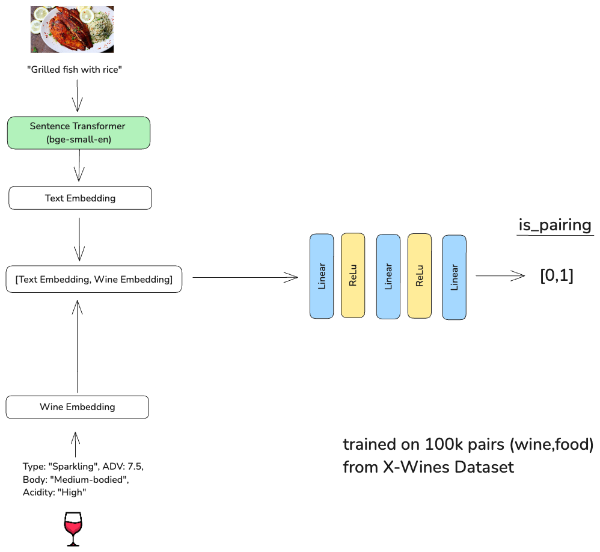

# BrainwaveBandits.WinerR

## ML Backend

### Wine-Food Pairing Model

Machine learning model designed to predict whether a specific wine and food pairing is a good match.
The model is a neural network which compromises both food (text) and wine embedding. The architecture in details:

- Text Embedding: Converts the food description (e.g., "Grilled fish with rice") into an embedding using a pre-trained language model (bge-small-en-v1.5). This helps the model understand the food context in a way that a machine can process.

- Wine Embedding: Converts wine features (like Type, ABV, Body, Acidity) into an embedding using a custom projection layer. This allows the model to represent the characteristics of the wine in a format that can be compared to the food embedding.

- Concatenation: Combines the food and wine embeddings into a single vector that represents the pairing of the two.

- Classification Layers: Uses fully connected layers to analyze the combined embeddings and output 0 or 1 whether the wine matches the food

The model is trained on 100k pairs from X-wine dataset (https://www.mdpi.com/2504-2289/7/1/20)

### Audio Transcription and Wine Name Extraction (audiowine.py)
This feature is designed to allow users to verbally describe wines in an audio recording. The system then transcribes the audio, extracts the mentioned wine names, and matches these names against a wine database. This is particularly useful for scenarios where a user is has is wines in front of him and want to insert them in the app.

Components:
- Transcribe Audio: Converts spoken words from an audio file into text using a speech-to-text model. This allows the system to process spoken descriptions or reviews of wines. It uses Whisper from OpenAI

- Extract Wine Names: Automatically identifies and extracts wine names from the transcribed text. This step is crucial for recognizing which specific wines are being discussed. It uses GPT-4o from OpenAI

- Match Wine Names: Matches the extracted wine names against a database of known wines to find the closest match. This helps in identifying the exact wines being referenced, even if the names are mentioned with slight variations.
